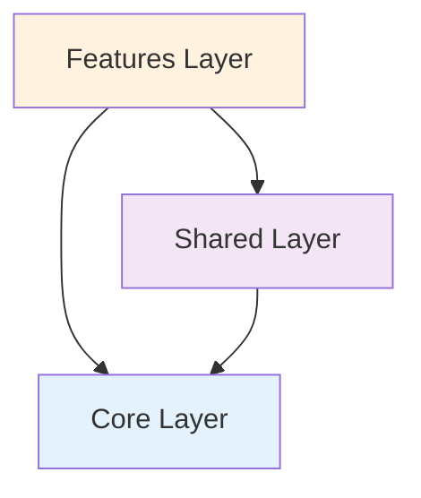

The Angular 18 Archetype follows a clean, modular architecture based on separation of concerns and best practices outlined in [Alberto Basalo's file and folder structure guide](https://albertobasalo.medium.com/file-and-folder-structure-for-angular-applications-3130efc582e3).

## Design principles

This architecture is built on several key principles:

<CardGroup cols={2}>
  <Card title="Separation of concerns" icon="layer-group">
    Each layer has a specific responsibility, preventing code mixing and improving maintainability
  </Card>
  <Card title="Modularity" icon="cubes">
    Components and services are organized into logical groups that can be easily understood and modified
  </Card>
  <Card title="Reusability" icon="recycle">
    Shared functionality is centralized to avoid duplication across the application
  </Card>
  <Card title="Scalability" icon="up-right-and-down-left-from-center">
    The structure supports growth by providing clear locations for new features and functionality
  </Card>
</CardGroup>

## Three-layer architecture

The application is organized into three distinct layers:

<Steps>
  <Step title="Core layer">
    Contains app-wide singleton services, guards, interceptors, and layout components that are used throughout the entire application.
    
    **Location:** `src/app/core/`
    
    <Info>
      The core layer is loaded once when the application starts and provides foundational services like authentication, error handling, and internationalization.
    </Info>
  </Step>
  
  <Step title="Shared layer">
    Houses reusable components, services, domain types, and UI elements that can be used across multiple features.
    
    **Location:** `src/app/shared/`
    
    <Info>
      The shared layer promotes code reuse and consistency by centralizing common functionality like state management, utilities, and UI components.
    </Info>
  </Step>
  
  <Step title="Features layer">
    Contains feature-specific modules that implement business logic and user-facing functionality.
    
    **Location:** `src/app/` (feature modules)
    
    <Info>
      Feature modules are typically lazy-loaded for better performance and contain their own components, services, and routing.
    </Info>
  </Step>
</Steps>

## Layer interaction

The layers interact following a clear dependency hierarchy:



<Note>
  **Dependency rules:**
  - Features can import from Shared and Core
  - Shared can import from Core
  - Core should not import from Shared or Features
  - This unidirectional flow prevents circular dependencies
</Note>

## Modern Angular features

This archetype leverages Angular 18's latest features:

### Standalone components

All components are standalone, eliminating the need for NgModules:

```typescript
@Component({
  selector: 'lab-notifications',
  standalone: true,
  changeDetection: ChangeDetectionStrategy.OnPush,
  imports: [],
  template: `...`
})
export class NotificationsComponent { }
```

### Signals for state management

The application uses Angular signals for reactive state management:

```typescript
export class AuthStore {
  #state: WritableSignal<UserAccessToken> = signal<UserAccessToken>(
    this.#localRepository.load('userAccessToken', NULL_USER_ACCESS_TOKEN)
  );
  
  isAuthenticated: Signal<boolean> = computed(() => this.accessToken() !== '');
}
```

### Functional guards and interceptors

Auth logic uses modern functional patterns instead of class-based implementations:

```typescript
export const authGuard: CanActivateFn = () => {
  if (environment.securityOpen) return true;
  const authStore = inject(AuthStore);
  if (authStore.isAuthenticated()) return true;
  const router = inject(Router);
  return router.createUrlTree(['/auth', 'login']);
};
```

## Configuration

The application uses a centralized configuration approach:

### Environment files

Environment-specific settings are managed through the `@env/*` path alias:

```typescript
import { environment } from '@env/environment';
```

### Path aliases

TypeScript path aliases simplify imports and improve code organization:

- `@ui/*` → Shared UI components
- `@domain/*` → Domain types and models
- `@state/*` → State management stores
- `@services/*` → Shared services
- `@api/*` → API service layer
- `@env/*` → Environment configuration

<Warning>
  Always use path aliases instead of relative imports (e.g., `../../../shared/domain`) to maintain clean and maintainable code.
</Warning>

## Next steps

<CardGroup cols={2}>
  <Card title="Folder structure" icon="folder-tree" href="/architecture/folder-structure">
    Explore the complete directory structure and naming conventions
  </Card>
  <Card title="Core layer" icon="shield" href="/architecture/core-layer">
    Learn about singleton services, guards, and interceptors
  </Card>
  <Card title="Shared layer" icon="share-nodes" href="/architecture/shared-layer">
    Discover reusable components and state management
  </Card>
</CardGroup>
